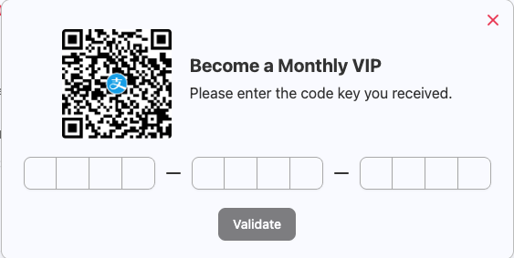
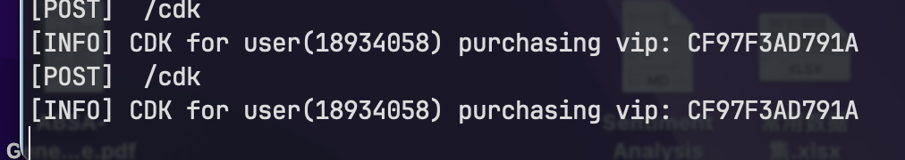
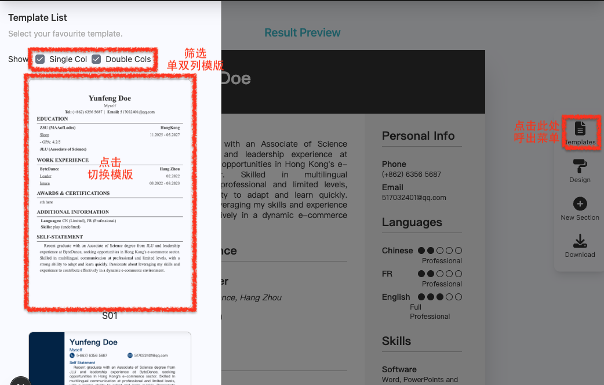
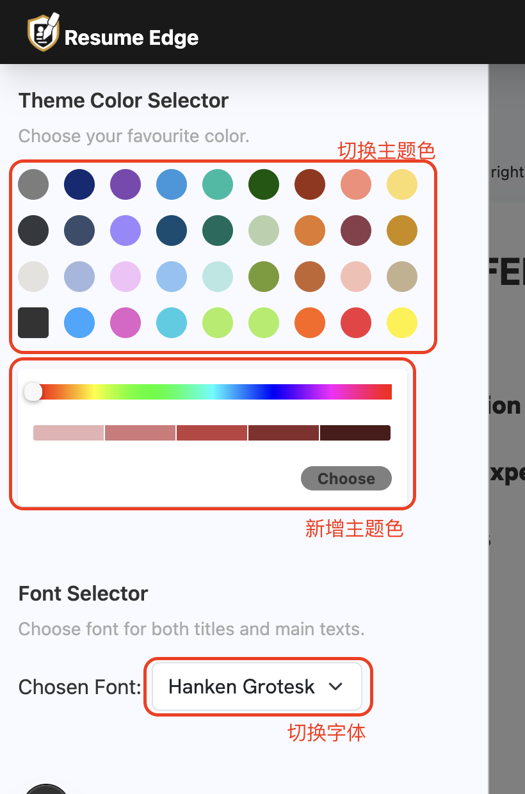

# ResumeEdge

<div align="center" style="margin-bottom: 20px;">

</div>
<div align="center">


</div>

## TODO

- 添加富文本编辑器 [TinyMice](https://juejin.cn/post/7124588377541705736)
- 添加 ETag 实现浏览器缓存

## Feature

ResumeEdge 是一个面向香港学生的一站式求职网站，是简历网站 [Zety](https://zety.com/) 的超级低配版。

- 简历方面

  - 支持从 DOCX 和 PDF 解析现有简历

  - 支持在线编辑简历

    - 提供多种模版，支持切换字体和主题色
    - 支持将结果导出为 PNG / PDF 格式

- 求职方面

    - 岗位推荐：根据求职者意向与简历内容，推送 jobsDB 上的真实岗位
- 
    - 职业路径模拟：支持对比就职于两家企业后的职业发展路径变化趋势（纯模拟）

## 技术栈与项目结构

### 技术选型

由于甲方需求，项目采用了 “前后端分离” 的架构（但技术选型很抽象）

- 前端：主要基于 Next 框架（但全都 `use client`）+ TailWindCSS（部分用行内硬改了）+ TypeScript（`any` 满天飞）

    - UI 组件库：ShadCN（没有钩子、不好用），AntDesign（不好覆盖样式）

        > Material-UI 自定义样式巨丑、MUI-tailWind 贼难用

    - 主题定制工具：字体选择器 [JS Font Picker](https://www.jsfontpicker.com/)，颜色选择器 [React Color](https://github.com/casesandberg/react-color)

    - 前端页面转 PNG/PDF：dom-to-image（本来用的 html2canvas，但疯狂错位）

        因为清晰度问题，手动覆盖了一下源码：

        ```js
        // @ function newCanvas()
        var ctx = canvas.getContext('2d');
        ctx.mozImageSmoothingEnabled = false;
        ctx.webkitImageSmoothingEnabled = false;
        ctx.msImageSmoothingEnabled = false;
        ctx.imageSmoothingEnabled = false;

        var scale = options.scale || 4; // 默认值 4
        canvas.width = (options.width * scale) || util.width(domNode)*scale;
        canvas.height = (options.height * scale) || util.height(domNode)*scale;
        ctx.scale(scale, scale);        // 添加了scale参数

        if (options.bgcolor) {
            ctx.fillStyle = options.bgcolor;
            ctx.fillRect(0, 0, canvas.width, canvas.height);
        }
        ```

    - 文件识别：

        - PDF 基于 [tesseract.js](https://github.com/naptha/tesseract.js#tesseractjs) 的 OCR 功能实现
  
          - 相关代码 [参考](https://github.com/racosa/pdf2text-ocr) 并修改成了 TS 版本
          - pdf-dist 部分的配置很坑爹（dev 能跑但打包疯狂报错），详见 `select.tsx`

        - DOCX 基于 mammoth

- 后端：主要基于 Koa 框架（😭 这东西拦截器也得加 async-await，不然完全没法异步）

    - DB 方面因为金主懒得配数据库，最后用了 LowDB（不太好配，但操作 JSON 还挺爽的）

    - 数据压缩：较长的字符串用了 lz-String

    - 信息提取和推荐系统：都基于 DeepSeek-R1 API 搓的（非常的慢）

- ⚠️ 功能大坑

    - 密码明文乱飞

    - 【✅已解决】异步执行实现混乱：lowDB 那边完全没管操作是否同步，直接前端设了个 Timeout 重新请求了

### 项目结构

```
.
├── backEnd         # 后端工程
│   ├── Controller      # 一些用于操作 DB 的函数
│   ├── data            # 数据文件 => 全是 JSON
│   ├── db              # 用于初始化 DB 的函数
│   ├── index.js        # 入口文件
│   ├── routers         # 各模块的分路由
│   └── utils           # 工具函数（LLM接口、CDK生成、爬虫）
├── frontEnd        # 前端工程
│   ├── components      # 一些组件
│   ├── lib             # 工具函数（Axios封装、字符串处理）
│   ├── pages           # 页面文件
│   ├── public          # 公共资源（但混进了 pdf-dist）
│   ├── styles          # 样式表
│   └── templates       # 简历模版文件
└── imgs            # README 要用到的图
```

## 项目运行

### 在一切开始前：安装环境

####  NodeJS 安装

前后端项目均基于 NodeJS(v23.9.0) 运行。

- 你可以通过在命令行提示符中输入以下命令，验证本机上是否成功安装

  ```bash
  node --version
  ```

  显示 `vXX.X.X` 就表示已经装好了（这个数字最好 `>= 23.9.0`

- 如果还没有安装的话：

  - Windows 请看 [这边](https://blog.csdn.net/WHF__/article/details/129362462#:~:text=%EE%80%80%E6%9C%AC%E6%96%87%E8%AF%A6%E7%BB%86%E4%BB%8B%E7%BB%8D%E4%BA%86%E5%A6%82%E4%BD%95%E4%BB%8E%E5%AE%98%E7%BD%91%E4%B8%8B%E8%BD%BD%E6%9C%80%E6%96%B0%E7%89%88%E7%9A%84Node.js%E5%AE%89%E8%A3%85%E5%8C%85%EF%BC%8C%E5%B9%B6%E8%BF%9B%E8%A1%8C%E7%8E%AF%E5%A2%83%E5%8F%98%E9%87%8F%E7%9A%84%E9%85%8D%E7%BD%AE%E5%92%8C%E6%B5%8B%E8%AF%95%E3%80%82%E8%BF%98%E6%8F%90%E4%BE%9B%E4%BA%86%E5%AE%89%E8%A3%85%E6%B7%98%E5%AE%9D%E9%95%9C%E5%83%8F%E7%9A%84%E6%96%B9%E6%B3%95%EF%BC%8C%E4%BB%A5%E6%8F%90%E9%AB%98npm%E7%9A%84%E4%B8%8B%E8%BD%BD%E9%80%9F%E5%BA%A6%E5%92%8C%E7%A8%B3%E5%AE%9A%E6%80%A7%E3%80%82%EE%80%81)

  - MacOS 可以尝试直接在命令行输入：

    ```bash
    brew install node
    ```

    如果报错的话，请先看 [这里](https://zhuanlan.zhihu.com/p/372576355#:~:text=%EE%80%80%E6%9C%AC%E6%96%87%E4%BB%8B%E7%BB%8D%E4%BA%86%E5%A6%82%E4%BD%95%E5%9C%A8MacBook%E4%B8%8A%E5%AE%89%E8%A3%85Homebrew%EF%BC%8C%E4%B8%80%E4%B8%AAMacOS%E7%9A%84%E8%BD%AF%E4%BB%B6%E5%8C%85%E7%AE%A1%E7%90%86%E5%99%A8%EF%BC%8C%E4%BB%A5%E5%8F%8A%E5%A6%82%E4%BD%95%E8%A7%A3%E5%86%B3%E5%9B%BD%E5%86%85%E7%BD%91%E7%BB%9C%E8%AE%BF%E9%97%AE%E9%97%AE%E9%A2%98%E3%80%82%E8%BF%98%E6%8F%90%E4%BE%9B%E4%BA%86Homebrew%E7%9A%84%E5%8D%B8%E8%BD%BD%E6%96%B9%E6%B3%95%E5%92%8C%E7%9B%B8%E5%85%B3%E9%93%BE%E6%8E%A5%E3%80%82%EE%80%81) 安装 Homebrew


#### NPM 换源 (Optional)

- 依赖资源会默认从境外服务器下载，所以可能会很慢

  > 不知道各位的网络环境下的速度如何，可以先跳过这一步

- 有需要的话，直接在命令行里输入以下命令（这里用了华为的镜像）：

  ```bash
  npm config set registry https://mirrors.huaweicloud.com/repository/npm/
  ```

### 前端

1. 修改请求地址

    ```js
    const apiClient = axios.create({
        baseURL: 'http://localhost:8080/api', // 换你自己的
        timeout: 120000
    })
    ```

2. 安装依赖 + 开跑

    ```bash
    cd path/to/frontEnd
    npm install
    npm run dev
    ```

### 后端

1. 配置 API-KEY：

    - 在后端根目录下新建 `.env` 文件，内容如下

        ```text
        MODEL_URL='https://api.deepseek.com'
        MODEL_KEY='sk-******'                # 替换为自己的 Key
        MODEL_NAME='deepseek-chat'
        ```

    - 没生有的话在 [这边](https://platform.deepseek.com/api_keys) 点击下面的 '创建 API key' 就可以了

        按步骤走完会给一串长 `sk-xxxx` 这个格式的字符串，粘到上面的第二行

1. 安装依赖 + 开跑

  ```bash
  cd path/to/backEnd
  npm install
  npm run dev
  ```

  如果嫌弃每次开服务打的一堆 log，可以注释掉 `index.js` 里的 `initDBs()`

  > 但没有初始化过的话，就老老实实开着吧！

2. 爬取最新的数据：用 Py 写的（JS 老报错、放服务器跑还会被 ban）

  ```bash
  npm run update # 会去爬 jobsDB 的 e-commerse 相关岗
  ```

## 构建

目前为前后端工程都写了构建脚本（请自行魔改 `package.json`）：
```bash
# frontEnd
npm run build # 打包+ 传到服务器
# backEnd
npm run build  # 压缩 + 传到服务器
npm run update # 重新从 jobsDB 爬取数据
npm run sync   # 把爬取的数据传到服务器
```

- 前端：原始打包方式会把 `node_modules` 整个塞进去，打出 1G+ 的工程 ... 

    改用 `standalone` 模式了（但 bug 多），可以用 `npm run build`

    > 魔改教程见 [这里](https://blog.csdn.net/qq_34241004/article/details/140154735)

- 后端：直接打了压缩包丢服务器上了（也不是很大）

## 部署

### NGINX 反向代理
> 反正我反向代理是配的痛苦面具了
> 
> => 最后发现是因为 Ubuntu 大小写超绝敏感肌，导致 backEnd 没跑起来 ...

下面是我的配置文件：
```text
# Web Server
server {
    listen 80; # port
    server_name localhost;
    server_name www.xxxx.icu;  # 域名
    server_name xx.x.xxx.xx;   # 支持直接通过 IP 访问
    charset utf-8; # defualt charset

    # 转发到后端端口
    location ^~ /api {
        #return 200 'prefix match';
        proxy_pass http://127.0.0.1:8080;
    }

    # 后端匹配不到的都用前端兜底
    location / {
        #return 200 'general match';
        proxy_pass http://127.0.0.1:3000;
        root html;
        index index.html index.htm;
    }

    # 错误页面（back to index）
    error_page 500 502 503 504 /50x.html;
    location = /50x.html {
        root front;
    }
}
```

> 在 NGINX 1.18.0 及以上版本中，配置应该书写在 `sites-available` 下（而不是直接改 `nginx.conf` 中），并软链接到 `sites-enabled`
>
> ```bash
> # 启用：建立软链接
> ln -s /etc/nginx/sites-available/resumeEdge /etc/nginx/sites-enabled/ resumeEdge
> # 请用 unlink [linkName] 移除链接，避免误伤源文件

### PM2 进程守护
> 用 nohup 挂后台跑还是太丑陋了

- 全局安装依赖

  ```bash
  npm install -g pm2
  ```

- 启动服务
  ```bash
  pm2 start app.js        # 启动，可以通过 --name [Name] 指定
  pm2 stop  app.js        # 停止 (也能用 name/index)
  pm2 stop  all           # 停止所有
  pm2 restart app.js      # 重启
  pm2 restart all         # 重启所有
  pm2 delete  app.js      # 关闭 (也能用 name/index)
  ```

- 实现开机自启（Azure 我淦你个自动重启 ...）

  ```bash
  # 通过制定 name 的方式启动项目
  sudo pm2 start backEnd/index.js --name backend
  
  # 启动所有需要自启的项目后，保存列表
  sudo pm2 save
  # backEnd 自启会有 bug：从 ~ 路径开始的相对引用路径不对 orz
  
  # 生成开机自启服务
  sudp pm2 startup
  
  # 启用开机自启服务
  sudo systemctl enable pm2-root
  
  # 重启服务器
  sudo reboot
  ```

## 页面功能介绍

### 首页


- 标签页
  - 会显示 `[网页名] | [当前页面]`
  - TODO：网站名字没起

- 顶栏
  - 左侧的 Logo 链接到首页
    - TODO：LOGO 还没选
  - 右侧是登录按钮
    - TODO：Options 没加超链接

- 主体
  - 点了 Button 会跳到填表的页面
  - 如果还没登录就会跳到 “登录/注册” 页面

- 底栏

  - 目前只打了 Copyright
  - 有需要放的联系方式可以列一下

- 适配屏幕稍窄的情况（ hover 后出现具体菜单选项）：

  .png)


### 登录/注册 页


目前是把两张卡片并排放了

- 注册

  - 手机号（用户名）：8位（或者需要改成12位？）
  - 密码：5～10 位的 数字+字母+ `!@#$%^&`（特殊字符）

- 登录：手机号 + 密码


- 顶栏（登录后）

  

  白色 icon 为普通用户（充值后变为蓝色）

  

  ~~把后端这串验证码输进去之后，点击 Validate 就可以了~~ 目前是 <span style="color:red">填写任意字符串</span> 后提交，均可以通过

  

### 个人信息表单

#### 初始化方式选择


- 支持 拖拽/从文件列表 选择文件
- 支持对 DOCX/PDF 中的简历进行解析（你也可以直接手填）
- 识别完成后会跳转至表单页面进行确认

#### Heading：姓名和联系方式


#### 教育经历

- 填写后的信息会出现在左侧列表，可以通过卡片下方的按钮 “编辑/删除”

- 可以点击 Summary 右侧的 + 号返回 “新建” 模式

.png)

#### 工作/实习经历

.png)

#### Skills + 其他部分

- 可以通过点击标签切换显示内容和编辑类型（Language 或 自定义 Skill）

.png)

#### Additional Blocks


- 功能上等价于 Zety 的 Add a Section
- TODO: 支持富文本编辑器

#### Self Statement

- 点击 Generate 可以生成个人陈述

  - 因为给 LLM 调了比较高的 Temp，所以多点几次的生成结果会不一样

- 限制了非会员只能用一次


### 下载与查看

在这个页面可以查看渲染结果


- 点击 Template 可以切换 单列/双列的模版

  - 会把 Zety 的十八个模版都写出来的orz

  - 下面这个是双列的模版

    

- 点击 Download 可以下载 PNG/PDF

  - 有限制未购买模版时仅下载一次
  - 购买操作和 VIP 一致，把后端的 CDK 粘贴过来就可以了

  

#### 自定义主题

- 支持模版选择：支持 zety 的所有模版（9单列+9双列）+ 一个单独给过我的单列模版

  

- 支持主题色和字体切换
  
  - Heading 部分字体在颜色较深时，会自动切换为白色

  - 由于 canvas 效果不稳定，仅支持部分 GoogleFont 字体（会同时影响标题和正文）

  

### 职业路径推荐

- <span style="color:red;">缺少能够统一查询公司信息的途径，公司信息简介暂缺</span>


- 打开页面会显示 loading / 稍后刷新

  - loading：放着不动会自动更新的，大约需要 30s~1min
  - 稍后刷新：需要在 1min 后手动刷新

- 数据来源：jobsDB 的 e-commerse 板块（约200条）

- 推送逻辑：普通用户推送 10 条 & VIP 用户推送 30 条

  1. 从数据库里抽 2N 条数据（计算所有 200 条会很慢）

      如果用户给定了 Preferred Job，将根据 字符串包含关系+编辑距离 筛选相符岗位

      抽样将首先在 match 的岗位中进行，不足时用 dismatch 岗位补足

  2. 用 DeepSeek 判断用户简历与 JD 是否一致（每一条后面会附上理由）
  3. 根据符合比例降序排序，推送前 N  条

- 可能的问题
  
  - <span style="color:red;">Apply 按钮会跳回 JobsDB，有时候会要求登录</span>
  - <span style="color:red;">限制了最大并发 20 个 Promise 请求，API 工作太慢可能导致请求超时（前端没处理）</span>

### 职业路径模拟

支持模拟用户 未来三年 内，在两家公司的不同职业路径发展结果


- 目前的实现：<span style="color:red;">纯 DeepSeek 模拟</span>

- 可能的问题：<span style="color:red;">对于两个野鸡公司，可能导致预测结果完全一致</span>

- 使用：从下拉列表里选择两个公司，全都 loading 完之后就会显示可交互图表
- 公司来源：jobsDB 爬来的 200 多个岗位涉及的公司