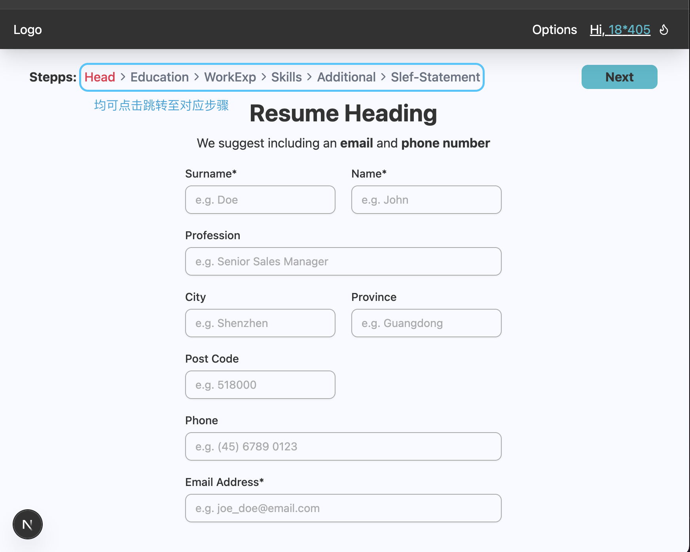

# README
> 可以用 Obsidian / Typora 查看本文档

## 1 项目运行

打开最外层的文件夹后，会看到这样一些东西：

```
.
├── backEnd   # 后端工程
├── frontEnd  # 前端工程
└── init.md   # 这个说明文件
```

### 1.1 在开始前：安装环境

#### 1.1.1 NodeJS

前后端项目均基于 NodeJS(v23.9.0) 运行。

- 你可以通过在命令行提示符中输入以下命令，验证本机上是否成功安装

    ```bash
    node --version
    ```

    显示 `vXX.X.X` 就表示已经装好了（这个数字最好 `>= 23.9.0`

- 如果还没有安装的话：

    - Windows 请看 [这边](https://blog.csdn.net/WHF__/article/details/129362462#:~:text=%EE%80%80%E6%9C%AC%E6%96%87%E8%AF%A6%E7%BB%86%E4%BB%8B%E7%BB%8D%E4%BA%86%E5%A6%82%E4%BD%95%E4%BB%8E%E5%AE%98%E7%BD%91%E4%B8%8B%E8%BD%BD%E6%9C%80%E6%96%B0%E7%89%88%E7%9A%84Node.js%E5%AE%89%E8%A3%85%E5%8C%85%EF%BC%8C%E5%B9%B6%E8%BF%9B%E8%A1%8C%E7%8E%AF%E5%A2%83%E5%8F%98%E9%87%8F%E7%9A%84%E9%85%8D%E7%BD%AE%E5%92%8C%E6%B5%8B%E8%AF%95%E3%80%82%E8%BF%98%E6%8F%90%E4%BE%9B%E4%BA%86%E5%AE%89%E8%A3%85%E6%B7%98%E5%AE%9D%E9%95%9C%E5%83%8F%E7%9A%84%E6%96%B9%E6%B3%95%EF%BC%8C%E4%BB%A5%E6%8F%90%E9%AB%98npm%E7%9A%84%E4%B8%8B%E8%BD%BD%E9%80%9F%E5%BA%A6%E5%92%8C%E7%A8%B3%E5%AE%9A%E6%80%A7%E3%80%82%EE%80%81)
    - MacOS 可以尝试直接在命令行输入：

        ```bash
        brew install node
        ```

        如果报错的话，请先看 [这里](https://zhuanlan.zhihu.com/p/372576355#:~:text=%EE%80%80%E6%9C%AC%E6%96%87%E4%BB%8B%E7%BB%8D%E4%BA%86%E5%A6%82%E4%BD%95%E5%9C%A8MacBook%E4%B8%8A%E5%AE%89%E8%A3%85Homebrew%EF%BC%8C%E4%B8%80%E4%B8%AAMacOS%E7%9A%84%E8%BD%AF%E4%BB%B6%E5%8C%85%E7%AE%A1%E7%90%86%E5%99%A8%EF%BC%8C%E4%BB%A5%E5%8F%8A%E5%A6%82%E4%BD%95%E8%A7%A3%E5%86%B3%E5%9B%BD%E5%86%85%E7%BD%91%E7%BB%9C%E8%AE%BF%E9%97%AE%E9%97%AE%E9%A2%98%E3%80%82%E8%BF%98%E6%8F%90%E4%BE%9B%E4%BA%86Homebrew%E7%9A%84%E5%8D%B8%E8%BD%BD%E6%96%B9%E6%B3%95%E5%92%8C%E7%9B%B8%E5%85%B3%E9%93%BE%E6%8E%A5%E3%80%82%EE%80%81) 安装 Homebrew

#### 1.1.2 NPM 换源 (Optional)

- 依赖资源会默认从境外服务器下载，所以可能会很慢

    > 不知道各位的网络环境下的速度如何，可以先跳过这一步

- 有需要的话，直接在命令行里输入以下命令（这里用了华为的镜像）：

    ```bash
    npm config set registry https://mirrors.huaweicloud.com/repository/npm/
    ```
#### 1.1.3 安装依赖

1. 进入项目根路径（`path/to/genMyResume`），这一步可以通过将文件夹拖到命令行里实现

2. 安装前端依赖，在命令行中依次输入以下命令

    ```bash
    cd frontEnd
    npm install
    ```

3. 类似的，我们可以安装后端依赖

    ```bash
    cd ../backEnd
    npm install
    ```

#### 1.1.4 配饰 API-KEY

目前 Self-Statement 生成的部分用到了 LLM（DeepSeek），这边需要做相关配置

1. 在后端工程根目录 `backEnd` 下新建一个名为 `.env` 的文件，内容如下：

    ```text
    MODEL_URL='https://api.deepseek.com'
    MODEL_KEY='sk-xxxxxxx'
    MODEL_NAME='deepseek-chat'
    ```

2. 获取 API-KEY：在 [这边](https://platform.deepseek.com/api_keys) 点击下面的 '创建 API key' 就可以了

    按步骤走完会给一串长 `sk-xxxx` 这个格式的字符串，粘到上面的第二行就好了

#### 1.1.5 Run：可以动起来了

因为是前后端分离项目，所以需要打开两个命令行窗口

1. 启动前端项目

    1. 进入前端根目录（把 `frontEnd` 文件夹拖进命令行窗口）
    2. 输入命令 `npm run dev`
   
2. 启动后端项目（一模一样呢）

    1. 进入前端根目录（把 `backEnd` 文件夹拖进命令行窗口）

        第一次跑会打很多 `[init] xxxx`，那个是在初始化数据库（你会发现 `backEnd/data` 下面多了很多 JSON 文件）

    2. 输入命令 `npm run dev`

## 2 页面（功能）介绍

### 2.1 首页


- 标签页
    - 会显示 `[网页名] | [当前页面]`
    - TODO：网站名字没起

- 顶栏
    - 左侧的 Logo 链接到首页
        - TODO：LOGO 还没选
    - 右侧是登录按钮
        - TODO：Options 没加超链接

- 主体
    - 点了 Button 会跳到填表的页面
    - 如果还没登录就会跳到 “登录/注册” 页面

- 底栏

    - 目前只打了 Copyright
    - 有需要放的联系方式可以列一下

### 2.2 登录/注册 页


目前是把两张卡片并排放了

- 注册

    - 手机号（用户名）：8位（或者需要改成12位？）
    - 密码：5～10 位的 数字+字母+ `!@#$%^&`（特殊字符）

- 登录：手机号 + 密码


- 顶栏（登录后）

    

    白色 icon 为普通用户（充值后变为蓝色）

    

    把后端这串验证码输进去之后，点击 Validate 就可以了

    

### 2.3 个人信息表单

#### 2.3.1 Heading：姓名和联系方式



#### 2.3.2 教育经历

- 填写后的信息会出现在左侧列表，可以通过卡片下方的按钮 “编辑/删除”

- 可以点击 Summary 右侧的 + 号返回 “新建” 模式

.png)

#### 2.3.3 工作/实习经历

.png)

#### 2.3.4 Skills + 其他部分

- 可以通过点击标签切换显示内容和编辑类型（Language 或 自定义 Skill）

.png)

#### 2.3.5 Additional Blocks（TODO）

> 功能上等价于 Zety 的 Add a Section

#### 2.3.6 Self Statement

- 点击 Generate 可以生成个人陈述

    - 因为给 LLM 调了比较高的 Temp，所以多点几次的生成结果会不一样

- 限制了非会员只能用一次


### 2.4 下载与查看

在这个页面可以查看渲染结果


- 点击 Template 可以切换 单列/双列的模版

    - 会把 Zety 的十八个模版都写出来的orz

    - 下面这个是双列的模版

        

- 点击 Download 可以下载 PNG/PDF

    - 有限制未购买模版时仅下载一次
    - 购买操作和 VIP 一致，把后端的 CDK 粘贴过来就可以了

    